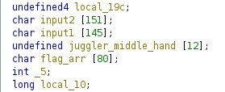
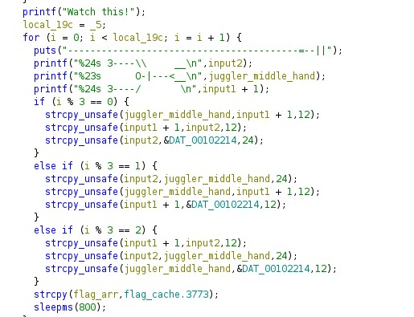
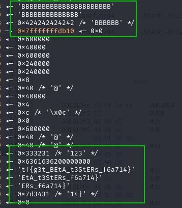
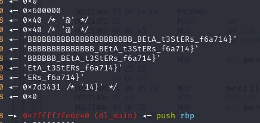
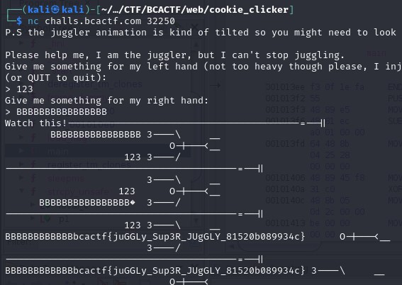

This was an easy challenge and fun to understand. Binary takes two inputs and juggles them.
Let's take a look at the source code using Ghidra.

It stores the data in a temporary array allocated just above the array where the flag is copied. As a result, when input2 with 24 bytes is stored in the temporary array it will overflow in the flag and will print input2 with the flag whenever it's printed next time.

I added input1 as **123** and input2 as **B*24**. At `i%3 == 1` we can look at the stack and see a temporary array containing input1 is just above the flag. After `strcpy_unsafe` is called input2 will go into the temporary array and overflows in the flag array.

   

 

